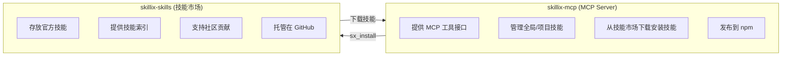
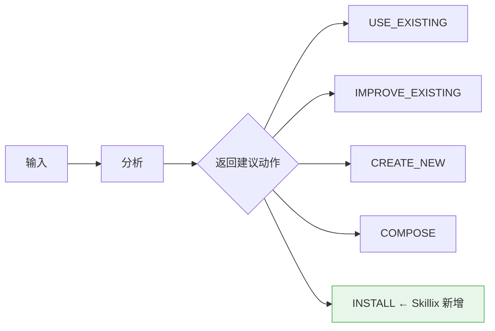
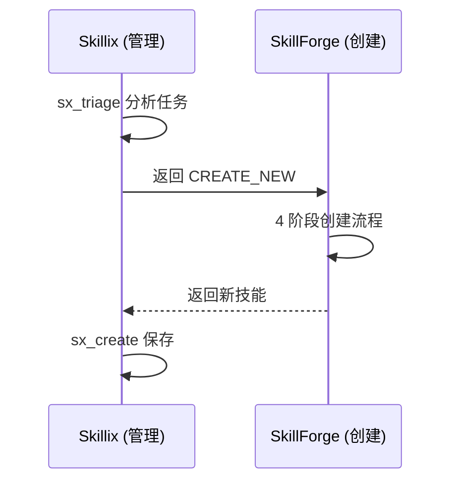

# Skillix 实现计划

> 日期: 2026-01-11
> 来源: 从初步设计构想拆分
> 更新: 添加双仓库架构和技能市场功能

---

## 一、双仓库架构

### 1.1 仓库规划

| 仓库 | GitHub 名称 | npm 包名 | 说明 |
|------|-------------|----------|------|
| **MCP Server** | `skillix-mcp` | `skillix-mcp` | MCP Server 实现，通过 npx 运行 |
| **技能市场** | `skillix-skills` | - | 官方技能市场，存放可共享的技能 |

> **注意**：当前 GitHub 仓库名为 `skillix`，建议重命名为 `skillix-mcp` 以保持命名一致性。
> 
> **重命名步骤**：
> 1. GitHub 仓库设置 → Rename → `skillix-mcp`
> 2. 本地更新远程地址：`git remote set-url origin https://github.com/user/skillix-mcp.git`
> 3. 新建 `skillix-skills` 仓库存放技能

### 1.2 仓库职责



---

## 二、阶段规划

### 阶段一：核心功能 (MVP)

**目标**：实现基础的技能管理功能

- [ ] 项目初始化 (skillix-mcp)
- [ ] MCP Server 基础框架
- [ ] sx_list 工具（区分全局/项目）
- [ ] sx_read 工具
- [ ] 全局配置支持 (~/.skillix/config.json)
- [ ] 项目配置支持 (.skillixrc.json)

### 阶段二：完整 CRUD

**目标**：实现技能的完整生命周期管理

- [ ] sx_create 工具（支持 scope 参数）
- [ ] sx_update 工具
- [ ] sx_delete 工具
- [ ] 资源（Resource）支持
- [ ] 技能查找优先级（项目 > 全局）

### 阶段三：技能市场

**目标**：实现技能市场功能

- [ ] sx_install 工具（从市场安装）
- [ ] sx_uninstall 工具（卸载技能）
- [ ] sx_search 工具（搜索市场）
- [ ] sx_sources 工具（管理技能源）
- [ ] GitHub API 集成
- [ ] 多技能源支持

### 阶段四：智能功能

**目标**：实现智能分流和自动建议

- [ ] sx_triage 工具（智能分流）
- [ ] sx_suggest 工具（自动建议）
- [ ] 自动检测重复模式
- [ ] 反馈收集机制 (sx_feedback)
- [ ] 反馈分析 (sx_analyze)

### 阶段五：生态建设

**目标**：完善生态系统

- [ ] npm 发布 (skillix-mcp)
- [ ] 技能市场仓库 (skillix-skills)
- [ ] 官方技能库（pdf, xlsx, docx 等）
- [ ] 文档完善
- [ ] 社区贡献指南

---

## 三、技术栈

| 技术 | 用途 |
|------|------|
| TypeScript | 主要开发语言 |
| @modelcontextprotocol/sdk | MCP SDK |
| Zod | 参数验证 |
| gray-matter | YAML frontmatter 解析 |
| fs-extra | 文件操作 |
| **@octokit/rest** | **GitHub API 客户端** |
| **simple-git** | **Git 操作（可选）** |

---

## 四、与其他方案对比

| 特性 | Skillix (MCP) | SkillForge | OpenSkills (CLI) | Shell 脚本 |
|------|---------------|------------|------------------|------------|
| 调用方式 | **工具调用** | SKILL.md | Bash 命令 | Bash 命令 |
| Cursor 集成 | **原生** | Claude Code | 需要 Rules | 需要 Rules |
| **全局可用** | **✅ 配置一次** | ❌ 每项目 | ✅ 全局安装 | ❌ 每项目复制 |
| **易于更新** | **✅ npm update** | ❌ 手动 | ✅ npm update | ❌ 手动同步 |
| **技能市场** | **✅ 支持** | ❌ 不支持 | ✅ 支持 | ❌ 不支持 |
| **全局/项目技能** | **✅ 支持** | ❌ 不支持 | ❌ 不支持 | ❌ 不支持 |
| 智能分流 | **✅ 支持** | ✅ 支持 | ❌ 不支持 | ❌ 不支持 |
| 创建技能 | **✅ 工具支持** | ✅ 4 阶段流程 | ❌ 手动 | ❌ 手动 |
| 跨平台 AI 工具 | **✅ 支持** | ❌ Claude Code | ❌ 不支持 | ❌ 不支持 |
| 依赖 | Node.js | Python | Node.js | 无 |

---

## 五、从 SkillForge 借鉴的设计

### 5.1 智能分流机制

SkillForge 的 Phase 0 "Universal Skill Triage" 是一个非常优秀的设计：



我们在 `sx_triage` 工具中实现了类似的机制，并新增了 `INSTALL` 动作。

### 5.2 领域匹配

SkillForge 使用**概念匹配**而非硬编码技能名称：

- 按领域分类（debugging、testing、spreadsheets 等）
- 智能同义词匹配
- 优雅降级（无匹配时返回 CREATE_NEW 或 INSTALL）

### 5.3 简化的设计

相比 SkillForge 的 4 阶段 + 多 Agent 审核，我们选择了更简化的方案：

| SkillForge | Skillix |
|------------|---------|
| 4 阶段架构 | 单步创建 |
| 11 个思维透镜 | 简化分析 |
| 多 Agent 审核 | 可选验证 |
| Python 脚本 | MCP 工具 |
| 本地技能 | **全局 + 项目 + 市场** |

### 5.4 未来可能的整合

Skillix 和 SkillForge 可以互补：



---

## 六、代码目录结构

### 6.1 skillix-mcp 仓库

```
skillix-mcp/
├── src/
│   ├── index.ts                 # MCP Server 入口
│   ├── server.ts                # Server 实现
│   ├── tools/                   # 工具实现
│   │   ├── index.ts
│   │   ├── triage.ts            # 智能分流
│   │   ├── list.ts              # 列出技能
│   │   ├── read.ts              # 读取技能
│   │   ├── create.ts            # 创建技能
│   │   ├── update.ts            # 更新技能
│   │   ├── delete.ts            # 删除技能
│   │   ├── install.ts           # 安装技能
│   │   ├── uninstall.ts         # 卸载技能
│   │   ├── search.ts            # 搜索技能
│   │   ├── sources.ts           # 管理技能源
│   │   ├── suggest.ts           # 自动建议
│   │   └── feedback.ts          # 反馈收集
│   ├── resources/               # 资源实现
│   │   └── skill-resource.ts
│   ├── utils/                   # 工具函数
│   │   ├── skill-parser.ts      # SKILL.md 解析
│   │   ├── skill-matcher.ts     # 技能匹配
│   │   ├── skill-loader.ts      # 技能加载
│   │   ├── github-client.ts     # GitHub API
│   │   ├── file-utils.ts        # 文件操作
│   │   ├── config.ts            # 配置管理
│   │   ├── logger.ts            # 日志工具（新增）
│   │   └── cache.ts             # 缓存管理（新增）
│   └── types/                   # 类型定义
│       └── index.ts
├── package.json
├── tsconfig.json
└── README.md
```

**本地存储目录**（MCP Server 启动时自动创建）：

```
~/.skillix/                      # 全局配置目录
├── config.json                  # 全局配置文件
├── skills/                      # 全局技能目录
│   ├── pdf/SKILL.md
│   └── ...
├── logs/                        # 日志目录
│   ├── skillix.log              # 主日志
│   └── skillix.log.1            # 轮转日志
├── cache/                       # 缓存目录
│   ├── sources/                 # 技能源索引缓存
│   └── downloads/               # 下载临时目录
└── data/                        # 数据目录
    ├── feedback.json            # 反馈数据
    └── statistics.json          # 使用统计
```

### 6.2 skillix-skills 仓库

```
skillix-skills/
├── skills/
│   ├── pdf/
│   │   └── SKILL.md
│   ├── xlsx/
│   │   └── SKILL.md
│   ├── docx/
│   │   └── SKILL.md
│   └── ...
├── index.json                   # 技能索引
├── CONTRIBUTING.md              # 贡献指南
└── README.md
```

---

## 七、总结

Skillix 是一个创新的技能管理 MCP Server，它：

1. **双仓库架构** - skillix-mcp (Server) + skillix-skills (市场)
2. **全局可用** - 配置一次，所有项目自动可用
3. **技能市场** - 支持从 GitHub 技能源安装和分享技能
4. **全局/项目技能** - 区分全局技能和项目级技能
5. **易于更新** - 通过 npm 自动更新
6. **原生集成** - 通过 MCP 工具与 Cursor 深度集成
7. **智能分流** - 自动判断使用/安装/创建技能
8. **跨平台支持** - 支持 Cursor、Claude Desktop、Claude Code 等
9. **标准兼容** - 100% 兼容 Anthropic SKILL.md 规范

通过 Skillix，AI 编码代理可以更智能地管理和使用技能，提升开发效率。

---

*本文档为 Skillix 实现计划文档*
*采用双仓库架构：skillix-mcp (MCP Server) + skillix-skills (技能市场)*
